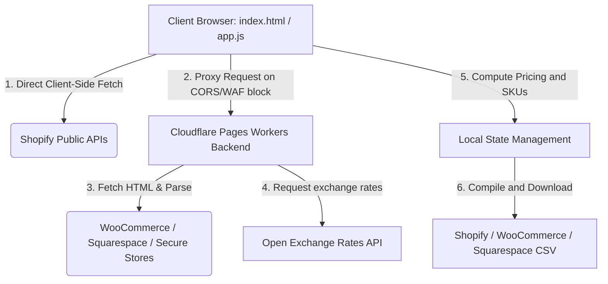

# 📘 Technical Specification & Service Guide - ShopShuttle

This document outlines the functional design, core features, system architecture, and serverless infrastructure of **ShopShuttle**.

---

## 1. Overview & Core Identity

### "A premium, client-first ETL utility that scrapes product metadata from e-commerce websites and formats them into platform-compliant CSV templates."

**ShopShuttle** is designed for merchants, developers, and dropshippers migrating or mirroring products across Shopify, Squarespace, and WooCommerce. It prioritizes data privacy, immediate UI response, and frictionless access.

### 🛡️ Core Trust Principles:
*   **Zero Server Storage Guarantee**: All CSV compilation, mapping, and calculations occur strictly inside your local browser memory (`state`). No product listings, source URLs, or credentials are ever saved on our servers.
*   **Free Lite Access**: This open-source community edition bypasses passcode checks, enabling immediate, free client-first scraping access.

---

## 2. Core Features (Merchant Value Priority)

### 💡 Lite Version Limit
*   **1 Link Extraction Limit**: To prevent server proxy abuse, the free Lite version enforces a limit of **1 product URL extraction at a time**. Bulk multiline parsing is restricted.

### 🔌 A. ShopShuttle Clipper (Chrome Extension)
*   **One-Click Clipping**: Extracts product titles, descriptions, options, images, and pricing matrices directly from the active tab.
*   **Active Tab Synchronization**: Transmits clipped products instantly to the open ShopShuttle web application using the secure cross-window message bridge (`web-bridge.js` listener).

### 🌐 B. Multi-Platform Product Scraper
*   **Shopify Extraction**: Resolves high-fidelity public product objects via client-side fetches directly to `/products/{handle}.js` (bypassing proxies whenever CORS is open).
*   **Squarespace Extraction**: Scrapes the page's HTML structure and locates the embedded `Static.SQUARESPACE_CONTEXT` object to parse option variants and specific pricing lists.
*   **WooCommerce Extraction**: Uses a multi-layered extraction technique:
    1.  Parses structured **JSON-LD (schema.org Product)** script blocks to capture title, category, description, and primary image.
    2.  Decodes the `data-product_variations` form attribute to map complex product variation weights and price details.
    3.  Falls back to standard DOM classes (e.g., `product_cat-[name]`, `product_tag-[name]`) for tag harvesting.

### 📊 C. Dynamic Spreadsheet Preview Grid
*   **Live Column Mapping**: Dynamically updates preview columns to match the target upload requirements (Shopify bulk CSV format, WooCommerce product import layout, or Squarespace CSV template).
*   **Interactive Editing**: Lets users inspect, review, and filter scraped items inside an interactive table before exporting the spreadsheets.

### 🔄 D. Squarespace Media Sync & Image Association
*   **Media Manager Association**: Automates the linking of product variant options to uploaded Squarespace Media Manager image IDs.
*   **Context-Aware UI**: This panel and its interactive mapping tools are dynamically displayed **only** when Squarespace is selected as the export target.

### 💱 E. Smart Tax (VAT) and Currency Processor
*   **Tax Adjustments**: Computes ex-VAT and inc-VAT calculations by detecting the source tax policy, extracting the net base cost, and applying target VAT settings.
*   **Currency Conversion Engine**: Converts original price values (GBP, DKK, EUR, etc.) to target store currencies (USD, KRW, CAD, etc.). Supports automated live exchange rate fetches (cached in `localStorage`) or manual custom exchange overrides.

### 🏷️ F. Custom SKU Generation Policies
*   **Handle-based Auto-generation**: Combines the URL product handle and variant ID to generate unique, predictable identification codes.
*   **Source SKU Preservation**: Imports and keeps original SKU codes from source e-commerce platforms.
*   **Empty Layout**: Excludes SKUs from columns, allowing destination store engines to assign identification numbers automatically.

### 🔑 G. Frictionless Passcode Access
*   **Instant Checkout Simulation**: Stripe-powered credit card checkout generates a unique 6-digit access passcode instantly.
*   **Automated Email Delivery**: Sends the newly generated passcode directly to the buyer's email using a responsive English template.

---

## 3. System Architecture & Data Flow

The application utilizes a hybrid architecture that balances client-side direct requests with server-side proxy fallback execution.

### Key Architectural Behaviors:
1.  **Hybrid Patching**: If target stores do not block requests using CORS or firewalls, the client-side JavaScript handles data retrieval directly to minimize server loads. If a request is blocked, the backend Cloudflare Worker serves as a proxy.
2.  **Reactive State Updates**: Changes to pricing formulas, tax margins, or SKU policies update the local state memory (`state`) instantly, triggering immediate re-renders of preview tables and export structures.

---

## 4. Technical Stack

| Category | Technology | Role |
| :--- | :--- | :--- |
| **Frontend** | HTML5, Vanilla JavaScript (ES6+), Vanilla CSS | Simple static page architecture utilizing a responsive Brutalist layout without third-party UI frameworks. |
| **Backend** | Cloudflare Pages (Serverless Functions) | Handles server-side scraping proxies and API routing (`functions/api/product.js`). |
| **Build Tools** | Cloudflare Wrangler | Used for local development emulation and deployment pipelines. |
| **Auth** | Clerk JWT & API Passcode Guard | Verifies authorization passcodes to secure backend functions. |

---

## 5. Third-Party Integrations & Libraries

1.  **Cloudflare Pages Functions**:
    *   **Role**: Hosts APIs and serves static frontend assets.
    *   **Behaviors**: Deployed at the edge to maintain minimal latency globally.
2.  **Open Exchange Rates API (`open.er-api.com`)**:
    *   **Role**: Supplies daily currency ratios.
    *   **Behaviors**: If API requests fail, the client defaults to the cached rates stored in the browser's `localStorage`.
3.  **Clerk & Passcode KV**:
    *   **Role**: Handles passcode verification and premium access controls.
4.  **Custom CSV Builder**:
    *   **Role**: Sanitizes and structures strings to ensure compatibility with target importing systems.

---

## 💡 Summary

This application functions as a **client-first ETL (Extract, Transform, Load) utility** that parses and standardizes product listings from multiple e-commerce structures, applies user-configured tax and currency rules, and maps them to standard bulk import formats.
